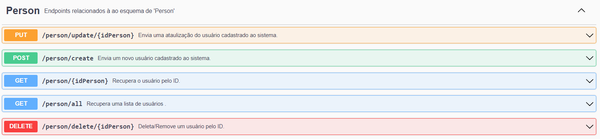
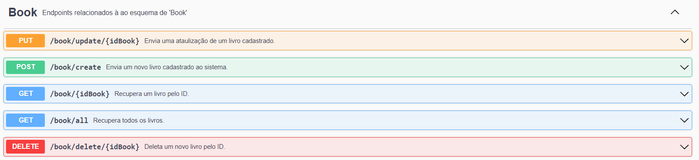
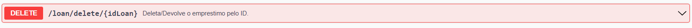

# Gerenciamento de Livros com Spring Boot e PostgreSQL

Este projeto tem como objetivo desenvolver um CRUD (Create, Read, Update e Delete), utilizando Postgres, Insominia SpringBoot e algumas de suas extensões para facilitar o desenvolvimento. Além disso, utilizamos o Swagger para fazer uma documentação mais detalhada e precisa para quem for utilizar nossa API.

# Funcionalidades
 
* CRUD Pessoa e seus respectivos EndPoints: 

* CRUD Livro e seus respectivos EndPoints: 

* Empréstimo de Livro: Implementamos uma função de emprestimo de um Livro 

* Devolução do Livro: Implementamos uma função para devolução de um Livro 

* Relação M:N: Implementamos a relação M:N entre Pessoas e Livros

# Documentação com Swagger
 Para entender mais sobre os detalhes da API, temos uma documentação feita com Swagger, e nesta documentação encontramos um material mais detalhado. Basta seguir o tópico das instruções e após iniciar a aplicação, acessar a seguinte url : `http://localhost:8080/swagger-ui/index.html#/` ou `{PORTA QUE VOCÊ ESTA USANDO}/swagger-ui/index.html`

# Instruções
Para utilizar o projeto, siga os passos abaixo:

1. Baixe o projeto: Acesse o repositório do projeto e baixe o código-fonte
2. Importe no seu IDE: Abra o projeto em seu IDE favorito, como IntelliJ IDEA ou Eclipse.
3. Configure o application.properties: Certifique-se de que o arquivo [application.properties] esteja configurado com as informações de conexão ao banco de dados e outras configurações necessárias.
4. Rode o programa: Execute a aplicação usando seu IDE ou terminal.
5. Aproveite!